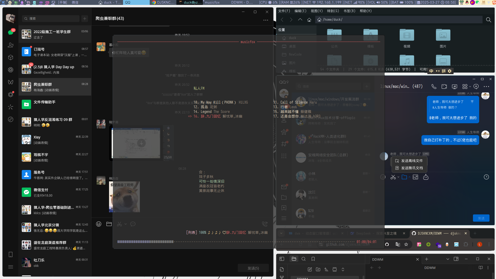

## DDWM是我的dwm分支(duck dwm)


这是一个概况

我觉得还不错，bar栏的信息显示还算算面，bar是slstatus，也是dwm系列产品
bar栏的窗口标签页支持隐藏和现实，可以鼠标点击和键盘快捷键
平铺模式下新新建窗口会在旧窗口之后，这点感谢C佬视频

### 键位
dwm原本是alt键位为modsuper，我更改为win键(键盘上带win标识的)
打开终端是win+enter 终端我使用kitty，需要提前安装和配置主题
打开rofi是win+d  rofi需要提前安装
```C

	{ MODKEY, XK_z, spawn, { .v = flameshot } }, // 使用火焰截图进行截屏需要提前安装
	{ MODKEY | ShiftMask, XK_d, spawn, { .v = rofi_window } }, // 使用rofi进行跳转应用窗口
	{ MODKEY, XK_space, togglescratch, { .ui = 0 } }, // 新建一个快捷终端窗口，使用的是st终端，需要提前安装
	{ MODKEY, XK_u, togglescratch, { .ui = 1 } }, // 打开网易云终端版本，需要提前安装
	{ MODKEY, XK_x, togglescratch, { .ui = 2 } }, // 这个暂时没写功能
	{ MODKEY, XK_w, spawn, { .v = volup } }, // 增加音量
	{ MODKEY, XK_s, spawn, { .v = voldown } }, // 减小音量
	// 对于这些东西可以在键位最开头的部分看见，我定义了很多功能实现
```

```shell

kitty rofi flameshot amixer st musicfox slstatus

```
首先运行
```shell
sudo make install
```
再运行
```shell
sudo ./dwma.sh # 这个文件是创建DM用的，不放心大可以打开看看
```

## 其他应该没了，有疑问可以加我
QQ 959735909
邮箱同上


